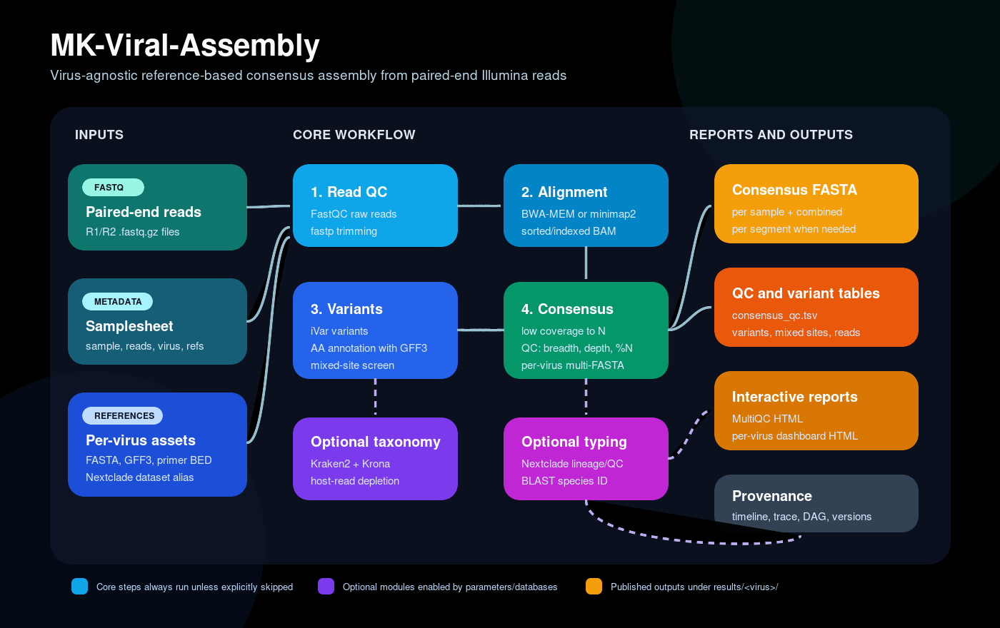

# MK-Viral-Assembly

[](https://doi.org/10.5281/zenodo.21248992)

**A reproducible Nextflow pipeline for reference-based viral genome assembly from paired-end Illumina short reads.**

MK-Viral-Assembly takes paired FASTQ files, maps them to a viral reference
genome, calls variants, builds consensus FASTA sequences, checks genome quality,
and writes browser-ready reports. It is designed for public-health genomic
surveillance, where the usual question is:

> “Given these sequencing reads and this virus reference, can I produce reliable
> consensus genomes and a clear QC report?”

The pipeline is **virus-agnostic**: the reference genome is a parameter, not hard
coded. The same workflow can be used for SARS-CoV-2, Dengue virus 1–4,
Chikungunya virus, Oropouche virus, RSV A/B, and other RNA or DNA viruses for
which you have a suitable reference FASTA. A single run can also contain
different viruses if each samplesheet row points to the correct reference,
annotation, primer BED, and/or Nextclade dataset.

The main outputs are:

- consensus genomes in FASTA format;
- per-sample consensus QC tables;
- variant and amino-acid mutation tables;
- optional taxonomy, lineage/genotype, and BLAST species-confirmation tables;
- one global MultiQC report;
- one self-contained HTML dashboard per virus.

If you are new to Nextflow, start with the built-in test below, then adapt one
of the example commands to your own FASTQ files.



---

## What it does

```
reads (fastq.gz, PE)
   │
   ├─ FastQC (raw)                       read QC
   ├─ fastp                              adapter + quality trimming
   ├─ FastQC (trimmed)                   read QC
   ├─ [Kraken2]                          optional taxonomic screen (contamination/co-infection)
   │   ├─ [taxonomy_summary]             per-sample composition table (target/host/unclass.)
   │   ├─ [Krona]                        interactive taxonomic sunburst (self-contained HTML)
   │   └─ [host depletion]               optional removal of host reads before mapping
   ├─ bwa-mem | minimap2  ──► sorted BAM  map to the reference
   ├─ [ivar trim]                        optional amplicon primer clipping (BED)
   ├─ samtools stats/flagstat/depth      alignment metrics
   ├─ ivar variants                      variant table (TSV)
   ├─ mixed_sites                        intra-sample heterozygosity screen (contamination signal)
   ├─ ivar consensus                     consensus genome (FASTA, low-cov → N)
   ├─ consensus_qc.py                    length, %N, breadth ≥Nx, mean/median depth
   ├─ [Nextclade]                        optional clade/lineage/genotype typing (per-run, aggregate)
   │                                     (Oropouche: auto L/M/S tefe datasets by segment)
   ├─ [BLAST vs RefSeq viral]            optional species confirmation (local DB, rebuilt if >7 d)
   ├─ MultiQC                            aggregated HTML report
   └─ dashboard (make_dashboard.py)      static surveillance dashboard (single HTML)
```

## Requirements

You need three things:

1. [Nextflow](https://www.nextflow.io/) ≥ 24.04.
2. One execution engine:
   - **Docker** on a workstation or server; or
   - **Singularity/Apptainer** on many HPC/Linux environments; or
   - **Conda/Mamba** if containers are not available.
3. Input files:
   - paired-end Illumina FASTQ files (`.fastq.gz` or `.fq.gz`);
   - a viral reference FASTA;
   - optionally a GFF3 annotation, a primer BED file, a Kraken2 database, and a
     Nextclade dataset.

With `-profile docker` or `-profile singularity`, the bioinformatics tools run in
containers. In normal use you do **not** need to install fastp, FastQC, BWA,
samtools, iVar, Kraken2, MultiQC, or Nextclade by hand.

## Quick start for new users

### 1. Clone or enter the repository

```bash
git clone https://github.com/nascimento-jean/MK-Viral-Assembly.git
cd MK-Viral-Assembly
```

If you already downloaded the folder, just enter it:

```bash
cd /path/to/MK-Viral-Assembly
```

### 2. Run the built-in test first

This creates a tiny artificial dataset and runs the pipeline with the test
configuration. It is the safest way to confirm that Nextflow and your container
engine are working.

```bash
python3 bin/make_testdata.py testdata/

nextflow run main.nf \
    -profile test,docker \
    --outdir results_test
```

If you use Singularity/Apptainer instead of Docker:

```bash
nextflow run main.nf \
    -profile test,singularity \
    --outdir results_test
```

After the test finishes, open:

```text
results_test/testvirus/testvirus_dashboard.html
results_test/multiqc/multiqc_report.html
```

### 3. Choose one input mode for real data

The pipeline supports two practical ways to provide samples.

| Input mode | Best for | What you provide |
|------------|----------|------------------|
| Folder mode | one virus/reference in a run | `--input` points to a folder of paired FASTQs plus one global `--reference` |
| Samplesheet mode | mixed viruses, per-sample references, or more control | `--input` points to a CSV with sample metadata |

Folder mode is simpler. Samplesheet mode is more flexible.

## Usage examples

### Example A — one virus, folder of FASTQs

Use this when all samples belong to the same virus and use the same reference.

```bash
nextflow run main.nf \
    -profile docker \
    --input /data/run01/chikv_fastqs \
    --virus chikv \
    --reference /refs/chikv/CHIKV_reference.fasta \
    --outdir results_chikv_run01
```

Expected output:

```text
results_chikv_run01/chikv/chikv_dashboard.html
results_chikv_run01/chikv/consensus/
results_chikv_run01/chikv/consensus_qc/
results_chikv_run01/multiqc/multiqc_report.html
```

### Example B — amplicon data with primer trimming and amino-acid annotation

Use `--primer_bed` for tiled-amplicon data so primer-derived bases do not bias
variant calls. Use `--gff` when you want amino-acid mutation annotation.

```bash
nextflow run main.nf \
    -profile docker \
    --input /data/run02/denv2_fastqs \
    --virus denv2 \
    --reference /refs/denv2/DENV2_reference.fasta \
    --primer_bed /refs/denv2/DENV2_primers.bed \
    --gff /refs/denv2/DENV2_annotation.gff3 \
    --outdir results_denv2_run02 \
    --run_name run02
```

### Example C — samplesheet run with different viruses

Create a CSV such as:

```csv
sample,fastq_1,fastq_2,virus,reference,gff,bed_file,nextclade_dataset
chikv_01,/data/chikv_01_R1.fastq.gz,/data/chikv_01_R2.fastq.gz,chikv,/refs/chikv/CHIKV.fasta,/refs/chikv/CHIKV.gff3,/refs/chikv/CHIKV.bed,chikv
denv2_02,/data/denv2_02_R1.fastq.gz,/data/denv2_02_R2.fastq.gz,denv2,/refs/denv2/DENV2.fasta,/refs/denv2/DENV2.gff3,/refs/denv2/DENV2.bed,denv2
orov_03,/data/orov_03_R1.fastq.gz,/data/orov_03_R2.fastq.gz,orov,/refs/orov/OROV_segments.fasta,/refs/orov/OROV.gff3,,oropouche
```

Then run:

```bash
nextflow run main.nf \
    -profile docker \
    --input samplesheet.csv \
    --outdir results_mixed_run \
    --nextclade true \
    --run_name mixed_run
```

This produces one output folder and one dashboard per virus:

```text
results_mixed_run/chikv/chikv_dashboard.html
results_mixed_run/denv2/denv2_dashboard.html
results_mixed_run/orov/orov_dashboard.html
```

### Example D — add taxonomic screening, host depletion, Nextclade, and BLAST

This is a more complete surveillance run. It requires local databases for
Kraken2 and BLAST/Nextclade downloads, so the first run can take longer.

```bash
nextflow run main.nf \
    -profile docker \
    --input samplesheet.csv \
    --outdir results_surveillance \
    --kraken2_db /databases/kraken2_standard_16gb \
    --deplete_host true \
    --nextclade true \
    --blast_id true \
    --run_name surveillance_batch_01 \
    --max_cpus 12 \
    --max_memory 48.GB \
    -resume
```

### Example E — build a samplesheet automatically from folders

`assets/virus_catalog.tsv` lets you define each virus reference/GFF/BED/dataset
once and reuse those paths every run.

Expected folder layout:

```text
/data/run17/
├── chikv/
│   ├── sampleA_R1.fastq.gz
│   └── sampleA_R2.fastq.gz
├── denv2/
│   ├── sampleB_R1.fastq.gz
│   └── sampleB_R2.fastq.gz
└── orov/
    ├── sampleC_R1.fastq.gz
    └── sampleC_R2.fastq.gz
```

Build the samplesheet:

```bash
python3 bin/make_samplesheet.py \
    --parent /data/run17 \
    --catalog assets/virus_catalog.tsv \
    --out samplesheet_run17.csv
```

Run the pipeline:

```bash
nextflow run main.nf \
    -profile docker \
    --input samplesheet_run17.csv \
    --outdir results_run17 \
    --nextclade true \
    --run_name run17 \
    -resume
```

## Samplesheet format

A samplesheet is a CSV file with a header. The first three columns are required:
`sample`, `fastq_1`, and `fastq_2`. Every column after `fastq_2` is optional and
can be set **per sample**.

```csv
sample,fastq_1,fastq_2,virus,reference,gff,bed_file,nextclade_dataset
chikv_01,/data/chikv_01_R1.fastq.gz,/data/chikv_01_R2.fastq.gz,chikv,/refs/CHIKV.fasta,/refs/CHIKV.gff3,/refs/chikv.bed,chikv
denv2_02,/data/denv2_02_R1.fastq.gz,/data/denv2_02_R2.fastq.gz,denv2,/refs/DENV2.fasta,,/refs/denv2.bed,dengue
orov_03,/data/orov_03_R1.fastq.gz,/data/orov_03_R2.fastq.gz,orov,/refs/OROV.fasta,/refs/OROV.gff3,,oropouche
```

| Column | Required? | Meaning |
|--------|-----------|---------|
| `sample` | yes | Unique sample ID used in output filenames and consensus headers |
| `fastq_1` | yes | R1 FASTQ file |
| `fastq_2` | yes | R2 FASTQ file |
| `virus` | no | Virus label; also the output folder name and catalog key |
| `reference` | no | Per-sample reference FASTA; overrides global `--reference` |
| `gff` | no | Per-sample GFF3 annotation; overrides global `--gff` |
| `bed_file` | no | Per-sample primer BED; overrides global `--primer_bed` |
| `nextclade_dataset` | no | Per-sample Nextclade dataset alias/path; overrides global `--nextclade_dataset` |

Empty optional cells fall back to the matching global parameter. If there is no
global value, that optional step is skipped for that sample.

### Negative controls

Samples whose sample ID or FASTQ filename starts with `CN` are treated as
negative controls. Examples:

```text
CN
CN-Butantan-04
CN_RUN_17
```

Valid `CN*` controls run through input validation, read QC/trimming and, when
`--kraken2_db` is provided, Kraken2/Krona taxonomic screening. They are then
excluded from host depletion, reference mapping, variant calling, consensus
generation, Nextclade, BLAST and combined FASTA outputs. Their role is to
validate the sequencing run, not to produce a consensus genome.

Empty or invalid `CN*` controls are skipped before downstream processing and are
reported in the dashboard as having no observed viral contamination.

## Key parameters

See [PARAMETERS.md](PARAMETERS.md) for the complete parameter guide and
[RUN_EXAMPLES.md](RUN_EXAMPLES.md) for portable execution examples.

| Parameter        | Default | Description |
|------------------|---------|-------------|
| `--input`        | –       | Samplesheet CSV (required) |
| `--reference`    | –       | Global reference FASTA (required unless every row sets its own) |
| `--outdir`       | `results` | Output directory |
| `--virus`        | –       | Virus label for **folder mode** (no samplesheet): names the per-virus output subfolder `outdir/<virus>/` and its `<virus>_dashboard.html`. Ignored in samplesheet mode (the `virus` column wins). Empty → `unspecified_virus` |
| `--aligner`      | `bwa`   | `bwa` (bwa-mem) or `minimap2` (`-ax sr`) |
| `--gff`          | –       | GFF3 (CDS) for the reference → `ivar variants` annotates amino-acid changes (adds `aa_change`, e.g. `S:N501Y`); per-sample override via a `gff` samplesheet column |
| `--primer_bed`   | –       | Global amplicon primer BED → `ivar trim` (e.g. ARTIC / Midnight schemes); per-sample override via the `bed_file` samplesheet column |
| `--min_cov`      | `20`    | Min coverage to call a consensus base (else `N`); `--min_depth` is a deprecated alias |
| `--min_freq`     | `0.75`  | Min alt-allele frequency for a consensus call |
| `--min_qual`     | `20`    | Min base quality (ivar) |
| `--min_map_qual` | `20`    | Min mapping quality |
| `--kraken2_db`   | –       | Kraken2 DB dir → taxonomic screen + Krona + taxonomy tab |
| `--deplete_host` | `false` | Remove host reads before mapping (requires `--kraken2_db`) |
| `--host_taxid`   | `9606`  | NCBI taxid depleted by `--deplete_host` (9606 = *Homo sapiens*) |
| `--mixed_min_freq` | `0.20` | Minor-allele freq lower bound for a "mixed" (heterozygous) site |
| `--mixed_max_freq` | `0.80` | Minor-allele freq upper bound for a "mixed" (heterozygous) site |
| `--nextclade`    | `false` | Run Nextclade clade/lineage/genotype typing on the consensus. Uses each sample's `nextclade_dataset` column, falling back to the global `--nextclade_dataset` |
| `--nextclade_dataset` | – | Global Nextclade dataset (full catalog path, e.g. `nextstrain/sars-cov-2/wuhan-hu-1/orfs`) **or** a short alias: `sars-cov-2`, `dengue`, `chikv`, `rsv-a`, `rsv-b`, `zika`, `yellow-fever`, `oropouche`. The `oropouche` alias auto-detects the segmented genome and downloads/runs the L/M/S *tefe* datasets. Per-sample override via the `nextclade_dataset` samplesheet column; a mixed run groups samples by dataset and types each virus against the right one |
| `--nextclade_tag` | `latest` | Pin a dataset version tag (recorded in the report; community datasets should be pinned) |
| `--nextclade_datasets_dir` | `assets/nextclade_datasets` | Persistent local cache for downloaded datasets (hybrid: reuse if present, else download) |
| `--blast_id`     | `false` | Confirm species by BLAST of the consensus against a local RefSeq viral DB |
| `--blast_db_dir` | `assets/blast_refseq_viral` | Persistent location of the RefSeq viral BLAST DB (built on first run, reused after) |
| `--blast_db_max_age_days` | `7` | Rebuild the RefSeq viral DB if older than this many days (checked at run time, not a cron) |
| `--skip_fastqc`  | `false` | Skip FastQC |
| `--skip_multiqc` | `false` | Skip MultiQC |
| `--skip_mixed_sites` | `false` | Skip the intra-sample heterozygosity screen |
| `--skip_dashboard` | `false` | Skip the static HTML dashboard |
| `--skip_combine` | `false` | Skip run-level combined multi-FASTA(s) |
| `--combine_min_status` | `WARN` | Lowest QC status kept in the combined FASTA(s): `PASS`\|`WARN`\|`FAIL` (default drops FAIL) |
| `--run_name`     | –       | Run label shown in the dashboard header (e.g. sequencing lot) |
| `--dash_pass`    | `0.90`  | Consensus completeness ≥ this → **PASS** badge |
| `--dash_warn`    | `0.70`  | Completeness ≥ this (and < pass) → **WARN**; below → **FAIL** |

Amplicon vs. metagenomic/shotgun: leave `--primer_bed` unset for shotgun/enrichment
data; set it for tiled-amplicon schemes so primer-derived bases don't bias variant
calls.

## Outputs

Results are **nested per virus**. Every analysis output for a given virus lives
under `results/<virus>/`, so a mixed run (e.g. CHIKV + DENV2 + Oropouche in one
samplesheet) produces one self-contained folder per virus — each with its own
dashboard named `<virus>_dashboard.html`. Only **MultiQC** and **pipeline_info**
stay global at the top level (they aggregate the whole run).

The `<virus>` folder name comes from the samplesheet `virus` column (folder mode:
the `--virus` label), lowercased and sanitised (`[^a-z0-9._-]` → `_`); an empty
value falls back to `--virus` then `unspecified_virus`.

```
results/
├── <virus>/                          e.g. chikv/, denv2/, orov/, sars-cov-2/
│   ├── fastqc/{raw,trimmed}/         FastQC reports
│   ├── fastp/<sample>/               trimmed reads + JSON/HTML
│   ├── alignment/                    sorted, indexed BAMs
│   ├── variants/                     <sample>.variants.tsv  (ivar; +aa_change col when --gff set)
│   ├── mixed_sites/                  <sample>.mixed_sites.tsv  (heterozygosity screen; only if not skipped)
│   ├── read_stats/                   <sample>.read_stats.tsv  (raw / post-fastp / post-deplete counts)
│   ├── consensus/                    <sample>.consensus.fa  +  <virus>_consensus[.<run>].fasta
│   │                                 (per-virus multi-FASTA; plus <virus>_consensus.<seg>[.<run>].fasta per segment)
│   ├── consensus_qc/                 <sample>.consensus_qc.tsv  (length, %N, breadth, depth)
│   ├── kraken2/                      <sample>.kraken2.report.txt  (only with --kraken2_db)
│   ├── krona/                        krona.html  +  taxonomy_summary.tsv  (only with --kraken2_db)
│   ├── run_validation/                negative-control Krona HTML (only when CN* controls + --kraken2_db)
│   ├── sample_validation/             <sample>.sample_validation.tsv  (input status; skipped/valid/CN*)
│   ├── nextclade/                    nextclade_summary.tsv  (clade/lineage/genotype; only with --nextclade)
│   ├── blast/                        blast_summary.tsv  (species confirmation; only with --blast_id)
│   └── <virus>_dashboard.html        static surveillance dashboard for THIS virus (open in any browser)
├── multiqc/                          multiqc_report.html   (global, whole run)
└── pipeline_info/                    timeline, report, trace, DAG (provenance; global)
```

A single-virus run just yields one such `<virus>/` folder plus the global
`multiqc/` and `pipeline_info/`.

**One dashboard is produced per virus** (`<virus>/<virus>_dashboard.html`), each
reflecting only that virus's samples — so a mixed run yields e.g.
`chikv/chikv_dashboard.html` and `denv2/denv2_dashboard.html` side by side. Each
dashboard is a single self-contained file — no server, no internet, no external
assets. Open it directly in a browser or attach it to a surveillance report. It is
organised into **tabs**:

- **Run Validation** — negative-control validation. `CN*` controls are listed
  individually. Controls with no viral signal are named as validated; controls
  with viral reads trigger an attention message and show the negative-control
  Krona result. Empty/problematic CN FASTQs are skipped and reported as having
  no observed viral contamination.
- **Overview** — PASS/WARN/FAIL cards, a donut of the run classification,
  aggregate statistics (median completeness/depth, variant totals) and
  histograms of completeness and mean depth.
- **Samples** — a sortable, text-filterable per-sample table (completeness,
  breadth, mean depth, length, N bases, variant count, aa-mutation count).
  Read-accounting columns are added when the data are available: **Reads**
  (raw reads, R1+R2, before filtering), **Post-fastp reads** (reads
  surviving fastp quality/adapter filtering) and **Post-depletion reads**
  (reads remaining after host removal — only shown when `--deplete_host` is
  used). Two reliability columns are also added: **Div. (/kb)**
  (PASS variants per kb of reference — a sample-swap / wrong-reference check)
  and **Mixed sites** (heterozygous sites per kb — red-flagged at ≥ 1.0/kb).
- **Coverage** — per-sample completeness and mean-depth bar charts.
- **Mutations** — most recurrent amino-acid changes, mutation load per
  gene/protein and a per-sample mutation list (only when `--gff` is supplied).
- **Lineages / Genotypes** — Nextclade clade/lineage/genotype per sample with the
  Nextclade QC verdict (good/mediocre/bad) and frameshift/stop-codon flags, plus a
  BLAST species-confirmation table (species, accession, % identity, coverage,
  E-value). For segmented viruses (Oropouche) the L/M/S lineages are shown together
  on one row. Shown only when `--nextclade` and/or `--blast_id` are set; the dataset
  name@tag and RefSeq DB provenance are printed in the report footer.
- **Taxonomy** — per-sample read composition (target virus / host / bacterial /
  unclassified), a composition mini-bar, the dominant non-host taxon and an
  embedded **Krona** sunburst. Host contamination ≥ 50 % is red-flagged. Shown
  only when `--kraken2_db` is set.
- **Segments** — per-segment metrics and completeness chart (only for
  segmented viruses, e.g. Oropouche L/M/S).

Charts are inline SVG drawn in pure Python; tab switching, table sorting and the
sample filter use a few lines of vanilla JS (with a `<noscript>` fallback that
reveals every panel).

The **combined multi-FASTA** (`<virus>/consensus/<virus>_consensus[.<run>].fasta`)
gathers every per-sample consensus for that virus into one file, ready for
alignment, phylogenetics or database submission. For **segmented** viruses (e.g.
Oropouche) an extra per-segment file is written too
(`<virus>_consensus.<segment>[.<run>].fasta`), so each segment can be aligned
independently. Filenames carry the `--run_name` label when set.

By default **FAIL samples are excluded** from the combined FASTA(s) (they carry
too many `N`s to be useful downstream), while PASS and WARN samples are kept.
Change the threshold with `--combine_min_status` (`PASS` keeps only PASS;
`FAIL` keeps everything). Excluded samples are listed in
`excluded_samples[.<run>].txt`. Per-sample consensus FASTAs are never filtered.
Disable the whole step with `--skip_combine`.

## Reliability & contamination controls

Reference-guided assembly is, by construction, robust to host contamination:
host reads do not align to the viral reference and therefore cannot enter the
consensus. Adapters are removed by fastp (`--detect_adapter_for_pe`,
quality/length trimming) and amplicon primers are soft-clipped by `ivar trim`
(`--primer_bed`). On top of that baseline the pipeline adds four surveillance
checks that surface sample swaps, cross-sample contamination and co-infections:

1. **Intra-sample heterozygosity (`mixed_sites`)** — a low-threshold iVar pass
   (`-t 0.03`) counts positions whose minor allele sits in an ambiguous band
   (`--mixed_min_freq`..`--mixed_max_freq`, default 0.20–0.80) at adequate depth.
   A clean single-genotype sample has almost none; an elevated rate
(**Mixed sites** ≥ 1.0/kb, red-flagged) is the most sensitive signal of
   cross-contamination or co-infection. Disable with `--skip_mixed_sites`.
2. **Consensus divergence (`Div. /kb`)** — PASS variants per kb of reference.
   An unexpectedly high value flags a sample swap or the wrong reference.
3. **Taxonomic composition (Kraken2 → taxonomy tab + Krona)** — with
   `--kraken2_db`, each sample's read composition (target virus / host /
   bacterial / unclassified) is tabulated and drawn as a Krona sunburst.
   Host reads ≥ 50 % are red-flagged. The Krona HTML is self-contained
   (built in text mode — no NCBI taxonomy download).
4. **Host-read depletion (`--deplete_host`)** — optionally removes host reads
   (taxid `--host_taxid`, default 9606, plus children) via KrakenTools
   *before* alignment. Requires `--kraken2_db` (e.g. a Standard-16 database).
   Amplicon PCR duplicates are **not** removed — they are expected and
   deduplication would degrade amplicon coverage.

## Lineage typing & species confirmation

Two optional downstream steps annotate the consensus without touching the
assembly:

- **Nextclade (`--nextclade`)** assigns clade/lineage/genotype and an
  independent QC verdict. Samples are grouped by their `nextclade_dataset`
  (per-sample column, or the global `--nextclade_dataset`), and each virus is
  typed **once against its own dataset** — so a mixed CHIKV + Dengue + Oropouche
  run classifies each correctly, with Oropouche handled as its L/M/S segmented
  trio. Datasets follow a **hybrid** cache: reused from `--nextclade_datasets_dir`
  if present, otherwise downloaded; the dataset **name@tag** is recorded in the
  dashboard footer.
  Community datasets (Chikungunya, Oropouche) are not official Nextstrain builds,
  so pin them with `--nextclade_tag`. Passing the `oropouche` alias auto-detects
  the segmented genome and runs the L/M/S *tefe* datasets, splitting the consensus
  records by segment length.
- **BLAST species confirmation (`--blast_id`)** blasts the consensus against a
  local **RefSeq viral** database. The DB is built on the first run into
  `--blast_db_dir` and reused afterwards; it is rebuilt when older than
  `--blast_db_max_age_days` (default 7), checked **at run time** (Nextflow cannot
  self-schedule, so this is an age-on-run check, not a cron job). The top hit per
  sample (species, accession, % identity, coverage) is reported and flagged when
  identity < 90 % or coverage < 80 %.

Both feed the **Lineages / Genotypes** dashboard tab.

## Reproducibility

- **Pinned tool versions** in every module (`conda`/`container` directives) → identical
  software across machines and over time.
- **Containerised execution** (`-profile docker|singularity`) → no host tool drift.
- **Provenance**: `pipeline_info/` holds the execution timeline, resource trace, DAG,
  and a `versions.yml` is emitted by every process.
- **Resource ceilings** via `resourceLimits` (`--max_cpus`, `--max_memory`,
  `--max_time`) → same pipeline scales from a laptop to a SLURM cluster.
- `-resume` reuses cached results for unchanged steps.

## Citation

If you use MK-Viral-Assembly in a report, publication or surveillance workflow,
please cite the archived software release:

> Nascimento, J. P. M. do. (2026). MK-Viral-Assembly: a Nextflow pipeline for
> viral consensus genome assembly (v1.0.0). Zenodo.
> https://doi.org/10.5281/zenodo.21248992

Citation metadata is provided in [`CITATION.cff`](CITATION.cff), and Zenodo
metadata is provided in [`.zenodo.json`](.zenodo.json).

## Choosing a reference (surveillance-relevant examples)

| Virus         | Example accession |
|---------------|-------------------|
| SARS-CoV-2    | `MN908947.3`      |
| Dengue 1–4    | `NC_001477` / `NC_001474` / `NC_001475` / `NC_002640` |
| Chikungunya   | `NC_004162`       |
| Oropouche     | segmented (L/M/S): `NC_005776`/`NC_005775`/`NC_005777` |
| RSV A / B     | `NC_038235` / `NC_001781` |

> For **segmented** viruses (e.g. Oropouche, L/M/S) supply a multi-FASTA reference
> containing all segments; mapping, variant calling and consensus are done per
> contig automatically, and the consensus FASTA has one record per segment
> (`>sample|contig`). Influenza is intentionally out of scope for this pipeline.

## Troubleshooting

### `nextflow: command not found`

Nextflow is not installed or is not available in your `PATH`. Install Nextflow
and then confirm:

```bash
nextflow -version
```

### Docker permission errors

On Linux, your user may need permission to run Docker. Test with:

```bash
docker run hello-world
```

If this fails, ask your system administrator to configure Docker access, or use
the `singularity` profile on systems where Singularity/Apptainer is available.

### No FASTQ pairs are found in folder mode

Folder mode expects paired files with common mate labels such as `_R1/_R2` or
`_1/_2`, ending in `.fastq.gz` or `.fq.gz`. If your filenames use another
pattern, provide `--fastq_pattern`.

### The output has too many `N` bases

The usual causes are low viral load, low sequencing depth, the wrong reference,
or a very strict consensus threshold. Check the dashboard, especially
completeness and mean depth. For low-depth datasets, consider lowering
`--min_cov` from `20` to `10` or `5`, but document that choice in your report.

### Nextclade or BLAST takes a long time on the first run

The first run may need to download/cache datasets or build a local RefSeq viral
BLAST database. Later runs reuse the cached data when possible.

## License / attribution

Assembled for the LACEN-AL / UFAL genomic-surveillance workflow. Tool credits:
fastp, FastQC, BWA, minimap2, samtools, iVar, Kraken2, MultiQC.
